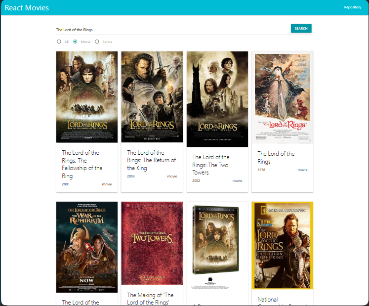
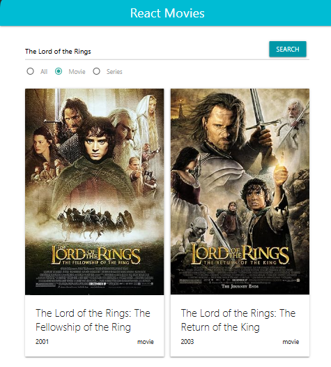
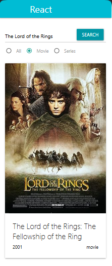

<h1 align="center">React-movies</h1>

## Description

This is my first project has written using React components. Implemented a movie search by name and type (movie or TV series).

## About the project.
- The markup is implemented using the front-end framework Materialize (https://materializecss.com).
- The markup is drawn dynamically using React componentsю
- The movie data for this project is obtained from an open database www.omdbapi.com. Requesting data using FETCH API.

## Adaptive design

The interface design is provided for various types of devices.

## **Desktop**

## **Tablet**

## **Mobile**

## **Processing an unsuccessful request**

## I invite you to see my other projects.
